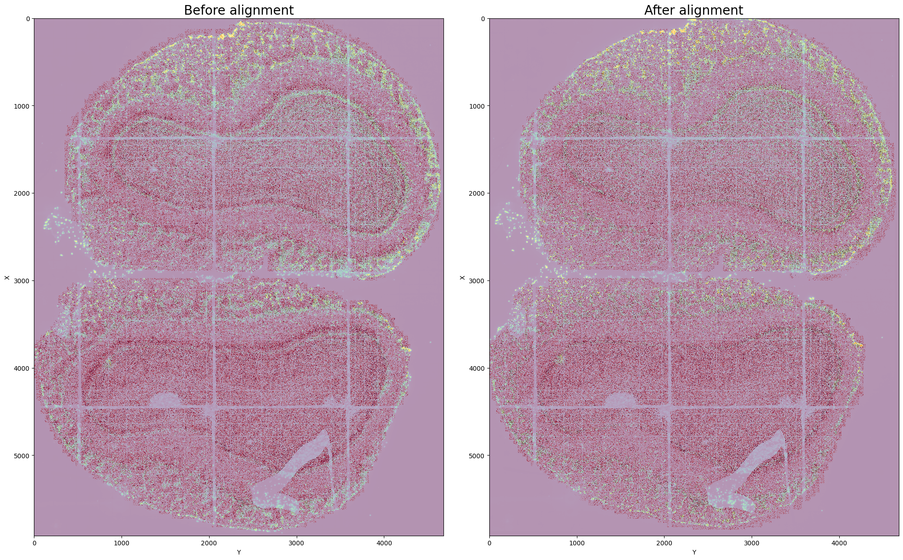
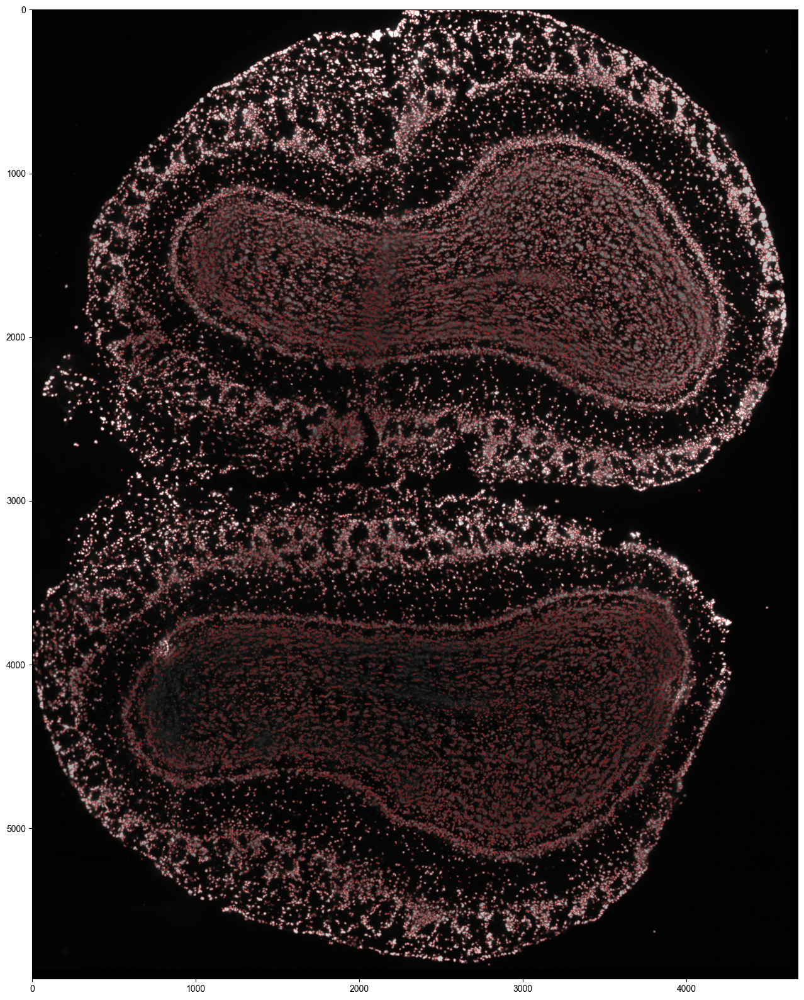

.. highlight:: shell

.. role:: bash(code)
   :language: bash

Mouse olfactory bulb (Stereo-seq)
---------------------------------

In this tutorial, we demonstrate the use of **Cellist** on a mouse olfactory bulb dataset profiled by Stereo-seq (`Chen et al., Cell, 2022 <https://www.sciencedirect.com/science/article/pii/S0092867422003993>`_).  
The dataset includes both spatial transcriptomics data and a corresponding ssDNA staining image. Processed data for this example can be downloaded from `here <https://1drv.ms/f/c/56f00afb348ea185/ElVFj1gccyRHpxGmN7tZ2OsBqv8wMH7BEjDgRiJn4_209A?e=oqfh4F>`_.

Step 1 Registration of staining image and spatial expression profile
>>>>>>>>>>>>>>>>>>>>>>>>>>>>>>>>>>>>>>>>>>>>>>>>>>>>>>>>>>>>>>>>>>>>

Although the staining images are approximately aligned with RNA coordinates, small shifts may still occur.  
The :bash:`align` command can be used to refine this alignment. It integrates the :bash:`refine_alignment` function with the rigid mode in `Spateo <https://spateo-release.readthedocs.io/en/latest/technicals/cell_segmentation.html#alignment-of-stain-and-rna-coordinates>`_.  
This step typically takes about **2 minutes** to complete.

::

   cellist align --gem Data/DP8400013846TR_F5.bin1.olfactorybulb_cropped.gem \
   --tif Data/ssDNA_cropped_3625_9545_950_5630.tiff \
   --nworkers 8 \
   --outdir Result/Alignment \
   --outprefix DP8400013846TR_F5

Step 2 Nucleus segmentation via Watershed
>>>>>>>>>>>>>>>>>>>>>>>>>>>>>>>>>>>>>>>>>

Nucleus segmentation is the first step before whole-cell segmentation in Cellist.  
Here we use the **watershed algorithm** to identify nuclei from the ssDNA-stained image, implemented via the :bash:`watershed` command.  
This step typically requires about **4 minutes**.

::

   cellist watershed --gem Data/DP8400013846TR_F5.bin1.olfactorybulb_cropped.gem \
   --tif Result/Alignment/DP8400013846TR_F5_regist_transposed_aligned_by_Spateo.tiff \
   --min-distance 6 \
   --outdir Result/Watershed \
   --outprefix DP8400013846TR_F5

Step 2 (Optional) Nucleus segmentation via Cellpose
>>>>>>>>>>>>>>>>>>>>>>>>>>>>>>>>>>>>>>>>>>>>>>>>>>>

As an alternative—particularly useful for dense tissues—users can apply :bash:`cellpose`, which employs a deep learning model for nucleus segmentation.  
On an NVIDIA GeForce RTX 3090 GPU, this step takes approximately **5 minutes**.

::

   cellist cellpose --gem Data/DP8400013846TR_F5.bin1.olfactorybulb_cropped.gem \
   --tif Result/Alignment/DP8400013846TR_F5_regist_transposed_aligned_by_Spateo.tiff \
   --diameter 10 \
   --expansion \
   --expansion-dist 9 \
   --outdir Result/Cellpose \
   --outprefix DP8400013846TR_F5

Step 3 Cell segmentation by Cellist
>>>>>>>>>>>>>>>>>>>>>>>>>>>>>>>>>>>

After nucleus segmentation, Cellist expands the nucleus boundaries to include the cytoplasmic region, thereby generating complete cell segmentation.  
Both **gene expression similarity** and **spatial proximity** are considered when assigning non-nuclear spots to nuclei.  
On a high-performance system, this step takes about **10 minutes**.

::

   cellist seg --platform barcoding \
   --resolution 0.5 \
   --gem Data/DP8400013846TR_F5.bin1.olfactorybulb_cropped.gem \
   --spot-count-h5 Result/Watershed/DP8400013846TR_F5_bin1.h5 \
   --nucleus-seg-method Watershed \
   --nucleus-prop Result/Watershed/DP8400013846TR_F5_Watershed_nucleus_property.txt \
   --nucleus-count-h5 Result/Watershed/DP8400013846TR_F5_Watershed_segmentation_cell_count.h5 \
   --nucleus-seg Result/Watershed/DP8400013846TR_F5_Watershed_nucleus_coord.txt \
   --nworkers 16 \
   --cell-radius 15 \
   --spot-imputation-distance 2.5 \
   --outdir Result/Cellist \
   --outprefix DP8400013846TR_F5

Alternatively, Cellist segmentation can also be performed using nuclei obtained from Cellpose.

::

   cellist seg --platform barcoding \
   --resolution 0.5 \
   --gem Data/DP8400013846TR_F5.bin1.olfactorybulb_cropped.gem \
   --spot-count-h5 Result/Cellpose/DP8400013846TR_F5_bin1.h5 \
   --nucleus-seg-method Cellpose \
   --nucleus-prop Result/Cellpose/DP8400013846TR_F5_cellpose_nucleus_property.txt \
   --nucleus-count-h5 Result/Cellpose/DP8400013846TR_F5_Cellpose_segmentation_cell_count.h5 \
   --nucleus-seg Result/Cellpose/DP8400013846TR_F5_Cellpose_nucleus_coord.txt \
   --nworkers 16 \
   --cell-radius 15 \
   --spot-imputation-distance 2.5 \
   --outdir Result/Cellist_cellpose \
   --outprefix DP8400013846TR_F5

The outputs of :bash:`seg` are stored in the :bash:`Result/Cellist` folder. A description of the output files is provided below:

+-------------------------------------------------------+----------------------------------------------------------------------------------+
| File                                                  | Description                                                                      |
+=======================================================+==================================================================================+
| Data_HVG/                                             | Directory containing small patches cropped from the slide.                       |
+-------------------------------------------------------+----------------------------------------------------------------------------------+
| {outprefix}_Cellist_segmentation.txt                  | Spot-level segmentation result, where each row represents a spot.                |
+-------------------------------------------------------+----------------------------------------------------------------------------------+
| {outprefix}_Cellist_segmentation_cell_count.h5        | Aggregated cell-level expression matrix in h5 format; rows are genes,            |
|                                                       | columns are cells.                                                               |
+-------------------------------------------------------+----------------------------------------------------------------------------------+
| {outprefix}_Cellist_segmentation_cell_coord.txt       | Spatial coordinates of segmented cells, corresponding to the expression file.    |
+-------------------------------------------------------+----------------------------------------------------------------------------------+
| {outprefix}_Cellist_segmentation_plot.pdf             | Visualization of cell segmentation results.                                      |
+-------------------------------------------------------+----------------------------------------------------------------------------------+
| {outprefix}_Cellist_corr_nucl_cyto_df.txt             | Correlation of expression between nucleus and cytoplasm within each cell.        |
+-------------------------------------------------------+----------------------------------------------------------------------------------+
| parameters.json                                       | Parameters used to run :bash:`cellist` and summary statistics of results.        |
+-------------------------------------------------------+----------------------------------------------------------------------------------+

