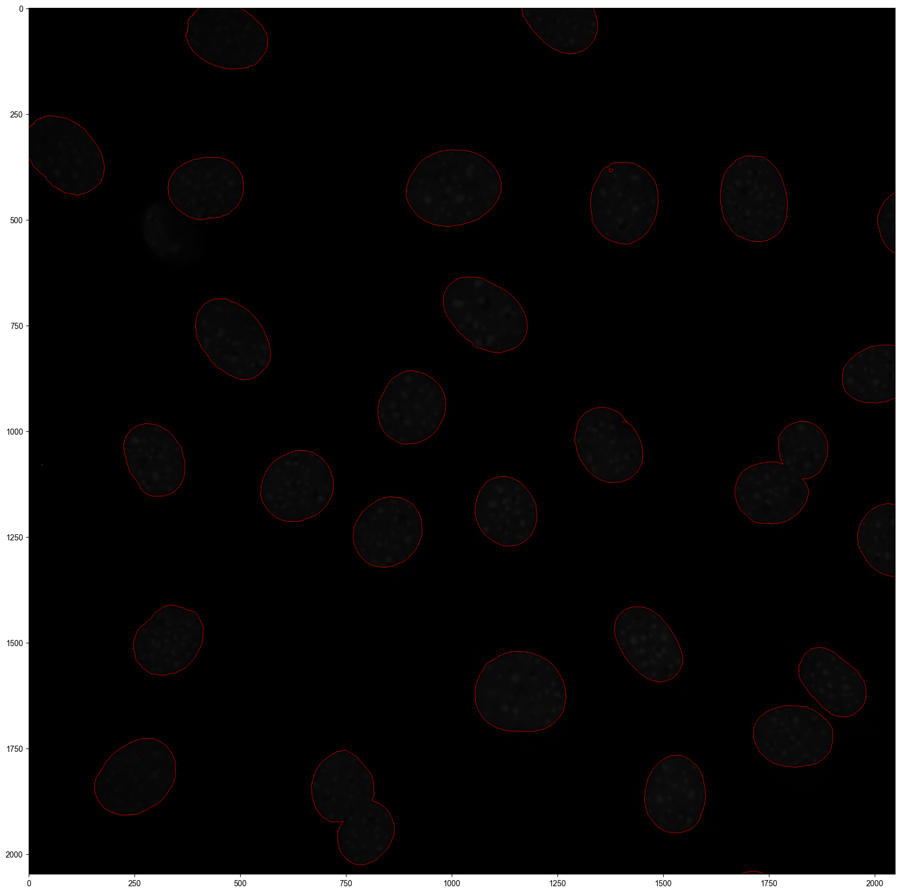
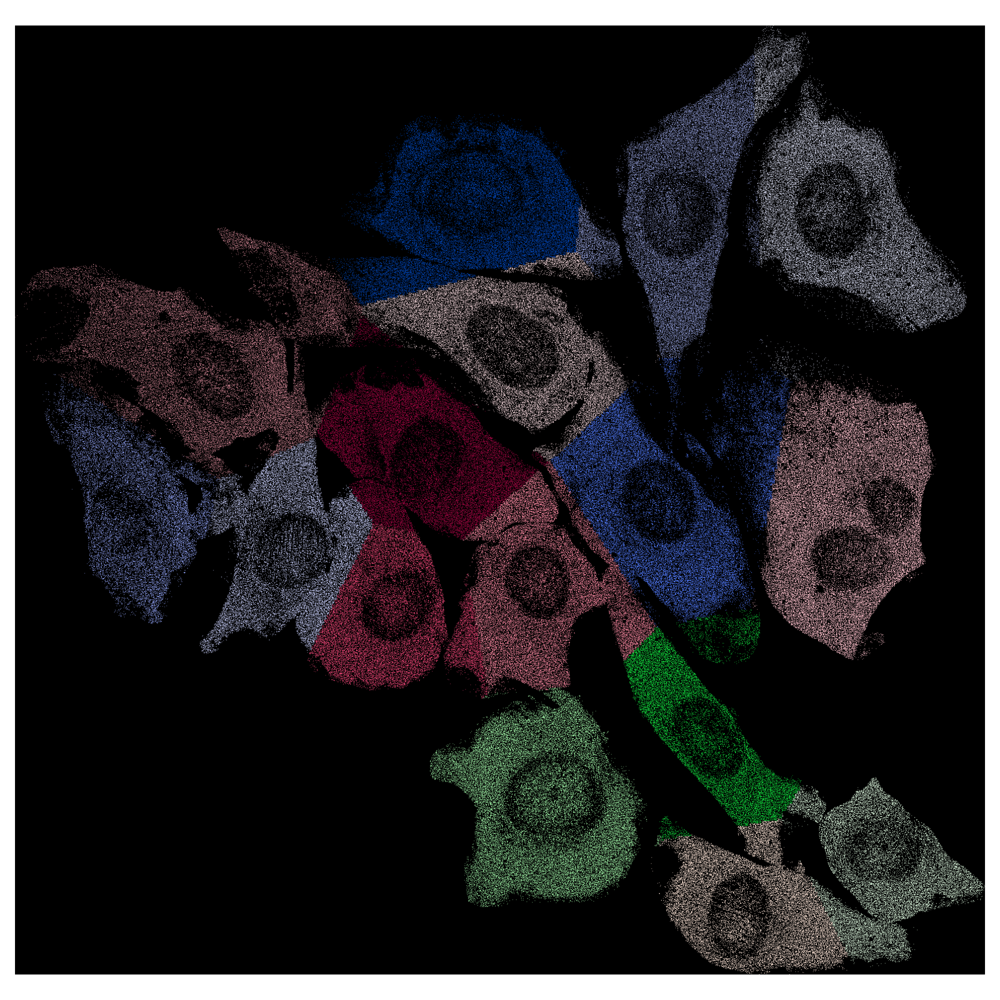

.. highlight:: shell

.. role:: bash(code)
   :language: bash

NIH/3T3 (seqFISH+)
------------------

This tutorial demonstrates the application of **Cellist** on an imaging-based high-resolution spatial transcriptomics platform. The NIH/3T3 seqFISH+ dataset was obtained from the study of `Eng et al., Nature, 2019 <https://www.nature.com/articles/s41586-019-1049-y>`_, which profiled 10,000 genes across 7 fields of view (FOVs) with additional DAPI staining. The demo dataset can be downloaded from `here <https://1drv.ms/f/c/56f00afb348ea185/Eii7F7aFMRBDufa_bHfp0EIBsDnA__sfRZrkNlES6v11tA?e=S7fUqX>`_.

Step 1 Pre-process
>>>>>>>>>>>>>>>>>>

Cellist was originally developed for barcoding-based high-resolution spatial transcriptomics, where each spot typically contains multiple transcripts. However, in seqFISH+ data, each transcript is detected at single-molecule resolution with a pixel size of ~103 nm.  

To make seqFISH+ data compatible with Cellist, transcripts are aggregated into bins of **5 × 5 pixels**, treating each bin as a “spot,” similar to Stereo-seq. This binning results in data with a resolution of ~0.5 μm, which is suitable for downstream analysis with Cellist. 

^^^^^^^^^^^^^^^^^^^^^^^^^^^^^^^^^^^^^^^^^^^^^
1. Convert array-like data to long data frame
^^^^^^^^^^^^^^^^^^^^^^^^^^^^^^^^^^^^^^^^^^^^^

.. code:: python

   import os
   import sys
   import scipy.io as sio
   import pandas as pd
   from Cellist.Utility import *
   from Cellist.Plot import *
   from Cellist.IO import *

   os.chdir("location_to_Cellist_demo_data/Cellist_demo_data/seqFISH_NIH3T3")
   data_dir = 'Data'
   res_dir = 'Result/Preprocess'
   if not os.path.exists(res_dir):
      os.makedirs(res_dir)

   run_mat_file = os.path.join(data_dir, 'RNA_locations_run_1.mat')
   gene_mat_file = os.path.join(data_dir, 'all_gene_Names.mat')

   mat_contents = sio.loadmat(run_mat_file)
   tot = mat_contents['tot']

   gene_mat = sio.loadmat(gene_mat_file)
   gene_list_all = gene_mat['allNames'].flatten()
   gene_list_all = [i[0] for i in gene_list_all]

   x_list = []  
   y_list = []
   cell_list = []
   gene_list = []
   fov_list = []
   gene_list_all_array = np.array(gene_list_all)
   for i in range(tot.shape[0]):
      print(i)
      for j in range(tot.shape[1]):
         for m in range(tot.shape[2]):
            data = tot[i, j, m]
            if data.shape[1] == 3:
               y_data = data[:, 0] 
               x_data = data[:, 1]
               n_points = len(y_data)
               x_list.extend(x_data)  
               y_list.extend(y_data)
               cell_list.extend(['Cell_%s' % j] * n_points)
               gene_list.extend([gene_list_all[m]] * n_points)
               fov_list.extend(['FOV_%s' % i] * n_points)

   coord_count_df = pd.DataFrame({'x':x_list, 'y':y_list, 'Manual_cell': cell_list, 'geneID': gene_list, 'FOV': fov_list, 'MIDCounts': 1})
   coord_count_df.to_csv(os.path.join(res_dir, 'seqFISH+_NIH3T3_points_RNA_rep1.txt'), sep = '\t', index = False)

^^^^^^^^^^^^^^^^^^^^^^^^^^^^^^^^^^^^^^^^^^^^^^^^^^^^^^^^
2. Generate pixel-level and bin-level data (5-pixel bin)
^^^^^^^^^^^^^^^^^^^^^^^^^^^^^^^^^^^^^^^^^^^^^^^^^^^^^^^^

.. code:: python

   coord_count_df = pd.read_csv(os.path.join(res_dir, 'seqFISH+_NIH3T3_points_RNA_rep1.txt'), sep = '\t', header = 0)
   fovs = coord_count_df['FOV'].unique()
   coord_count_df_cp = coord_count_df.copy()

   coord_count_df_cp['x'] = coord_count_df_cp['x'].astype(int)
   coord_count_df_cp['y'] = coord_count_df_cp['y'].astype(int)

   bin_size = 5
   coord_count_df_cp['x_bin'] = (coord_count_df_cp['x'] / bin_size).astype(np.uint32) * bin_size
   coord_count_df_cp['y_bin'] = (coord_count_df_cp['y'] / bin_size).astype(np.uint32) * bin_size
   coord_count_df_cp['binID'] = coord_count_df_cp['x_bin'].astype(str) + "_" + coord_count_df_cp['y_bin'].astype(str)

   for fov in fovs:
      print(fov)
      out_dir = os.path.join(res_dir, fov)
      if not os.path.exists(out_dir):
         os.mkdir(out_dir)
      fov_mask = coord_count_df_cp['FOV'] == fov
      fov_count_df = coord_count_df_cp.loc[fov_mask].copy()
      fov_coord_df = fov_count_df.drop_duplicates(["x", "y"])
      fov_coord_df['Manual_cell_ID'] = fov_count_df['Manual_cell'].astype('category').cat.codes + 1
      # draw the manual segmentation result
      draw_segmentation(fov_coord_df, "Manual_cell_ID", f"{fov}_Manual", out_dir, 
                     x="x", y="y", figsize=(20, 20))
      # write bin1 
      bin1_count_df = fov_count_df[["geneID", "x", "y", "MIDCounts"]].copy()
      bin1_count_df = bin1_count_df.sort_values(by=["x", "y"])
      bin1_file = os.path.join(out_dir, f'seqFISH+_NIH3T3_points_RNA_rep1_{fov}_bin1.txt')
      bin1_count_df.to_csv(bin1_file, sep='\t', index=False)
      bin1_count_df['x_y'] = bin1_count_df['x'].astype(str) + '_' + bin1_count_df['y'].astype(str)
      gene_spot = bin1_count_df.groupby(['x_y', 'geneID'])['MIDCounts'].sum()
      spot_expr_mat, gene_list, spot_list = longdf_to_mat(gene_spot)
      count_h5_file = os.path.join(out_dir, f"seqFISH+_NIH3T3_points_RNA_rep1_{fov}_bin1.h5")
      write_10X_h5(filename=count_h5_file, matrix=spot_expr_mat, 
                features=gene_list, barcodes=spot_list, datatype='Gene')
      # write bin5
      bin5_grouped = fov_count_df.groupby(['x_bin', 'y_bin', 'geneID'])['MIDCounts'].sum().reset_index()
      bin5_count_df = bin5_grouped.rename(columns={'x_bin': 'x', 'y_bin': 'y'})
      bin5_file = os.path.join(out_dir, f'seqFISH+_NIH3T3_points_RNA_rep1_{fov}_bin5.txt')
      bin5_count_df.to_csv(bin5_file, sep='\t', index=False)
      bin5_count_df['x_y'] = bin5_count_df['x'].astype(str) + '_' + bin5_count_df['y'].astype(str)
      gene_spot_bin5 = bin5_count_df.groupby(['x_y', 'geneID'])['MIDCounts'].sum()
      spot_expr_mat_bin5, gene_list_bin5, spot_list_bin5 = longdf_to_mat(gene_spot_bin5)
      count_h5_file_bin5 = os.path.join(out_dir, f"seqFISH+_NIH3T3_points_RNA_rep1_{fov}_bin5.h5")
      write_10X_h5(filename=count_h5_file_bin5, matrix=spot_expr_mat_bin5, 
                features=gene_list_bin5, barcodes=spot_list_bin5, datatype='Gene')

^^^^^^^^^^^^^^^^^^^^^^^^^^^^^^^^^^^^^^^^^
3. Convert OME-TIFF file to 2D TIFF image
^^^^^^^^^^^^^^^^^^^^^^^^^^^^^^^^^^^^^^^^^

.. code:: python

   from pyometiff import OMETIFFReader
   from skimage.io import imread, imsave

   data_dir = 'Data'
   res_dir = 'Result/Preprocess'

   for fov in range(7):
      out_dir = os.path.join(res_dir, 'FOV_%s' %fov)
      print(out_dir)
      if not os.path.exists(out_dir):
        os.mkdir(out_dir)
      img_path = os.path.join(data_dir, 'DAPI_experiment1/final_background_experiment1/MMStack_Pos%s.ome.tif' %fov)
      reader = OMETIFFReader(fpath = img_path)
      img_array, metadata, xml_metadata = reader.read()
      img = img_array[3,1,:,:]
      imsave(os.path.join(out_dir, 'MMStack_Pos%s_2D.tif' %fov), img)

Step 2 Watershed segmentation of nucleus
>>>>>>>>>>>>>>>>>>>>>>>>>>>>>>>>>>>>>>>>

Nucleus segmentation is the prerequisite for subsequent whole-cell segmentation with Cellist. Cellist supports two nucleus segmentation methods: **watershed** and **Cellpose**. In this example, we apply the **watershed** algorithm to segment nuclei from DAPI-stained images, implemented through the :bash:`watershed` command, using FOV_0 as a demonstration.

::

   cellist watershed --platform imaging \
   --gem Result/Preprocess/FOV_0/seqFISH+_NIH3T3_points_RNA_rep1_FOV_0_bin5.txt \
   --tif Result/Preprocess/FOV_0/MMStack_Pos0_2D.tif \
   --min-distance 100 \
   --outdir Result/Watershed/FOV_0 \
   --outprefix FOV_0

Step 3 Cell segmentation by Cellist
>>>>>>>>>>>>>>>>>>>>>>>>>>>>>>>>>>>

After nuclei are segmented, Cellist expands the nucleus boundaries to include the cytoplasmic region, thereby achieving whole-cell segmentation. During this process, both **gene expression similarity** and **spatial proximity** are taken into account when assigning non-nuclear spots to their corresponding nuclei.

::

   cellist seg --platform imaging \
   --resolution 0.1 \
   --gem Result/Preprocess/FOV_0/seqFISH+_NIH3T3_points_RNA_rep1_FOV_0_bin5.txt \
   --spot-count-h5 Result/Preprocess/FOV_0/seqFISH+_NIH3T3_points_RNA_rep1_FOV_0_bin5.h5 \
   --nucleus-seg-method Watershed \
   --nucleus-prop Result/Watershed/FOV_0/FOV_0_Watershed_nucleus_property.txt \
   --nucleus-count-h5 Result/Watershed/FOV_0/FOV_0_Watershed_segmentation_cell_count.h5 \
   --nucleus-seg Result/Watershed/FOV_0/FOV_0_Watershed_nucleus_coord.txt \
   --nworkers 16 \
   --cell-radius 10 \
   --spot-imputation-distance 2.5 \
   --noise-prop 0 \
   --outdir Result/Cellist/FOV_0 \
   --outprefix FOV_0

:bash:`seg` generates cell segmentation results and corresponding visualizations at the **bin level**. For more detailed visualization, users can project the bin-level segmentation results back to the **pixel level**.

.. code:: python

   import pandas as pd
   from Cellist.Plot import *

   coord_count_df = pd.read_csv(os.path.join('Result/Preprocess', 'seqFISH+_NIH3T3_points_RNA_rep1.txt'), sep = '\t')
   bin_size = 5
   coord_count_df['x'] = coord_count_df['x'].astype(int)
   coord_count_df['y'] = coord_count_df['y'].astype(int)
   coord_count_df = coord_count_df.sort_values(by = ["x", "y"])
   coord_count_df['x_bin'] = (coord_count_df['x']/bin_size).astype(np.uint32)*bin_size
   coord_count_df['y_bin'] = (coord_count_df['y']/bin_size).astype(np.uint32)*bin_size
   coord_count_df['x_y'] = coord_count_df['x_bin'].astype(str) + "_" + coord_count_df['y_bin'].astype(str)

   cellist_res = 'alpha_0.8_sigma_1.0_beta_10_gene_HVG_dist_10_twostep_False_cyto_False_noise_0.0_neigh_2.5'
   fov = 0
   print(fov)
   cellist_dir = os.path.join('Result/Cellist', 'FOV_%s' %fov, cellist_res)
   out_dir = os.path.join('Result/Cellist', 'FOV_%s' %fov, cellist_res)
   cellist_file = os.path.join(cellist_dir, 'FOV_%s_Cellist_segmentation.txt' %fov)
   cellist_df = pd.read_csv(cellist_file, sep = '\t')
   fov_count_df = coord_count_df.loc[coord_count_df['FOV'] == 'FOV_%s' %fov,:].copy()
   fov_cellist_df = pd.merge(fov_count_df, cellist_df[['x_y', 'Cellist']], on = ['x_y'], how = 'right')
   fov_cellist_df = fov_cellist_df.fillna(0)
   fov_cellist_df_coord = fov_cellist_df.drop_duplicates(['x', 'y'])
   draw_segmentation(fov_cellist_df_coord, "Cellist", "FOV_%s_Cellist" %fov, out_dir, x = "x", y = "y", figsize = (10,10))

